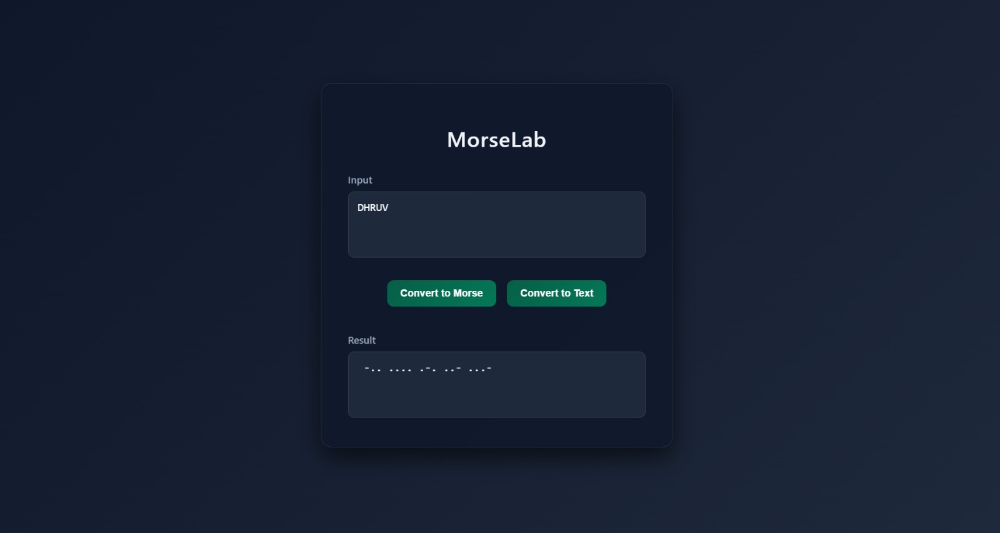

# MorseLab 📡

MorseLab is a Flask-based web application that allows users to **encode plain text into Morse code** and **decode Morse code back into readable text** through a clean and responsive web interface.

---

# 🌐 Live Demo

**Try the application here:**

https://morselab.onrender.com

> **Note:** The application is hosted on Render's free tier, so the first request may take a few seconds if the server is waking up.

---

# 📸 Preview



---

# 🚀 Features

- Encode plain text into Morse code
- Decode Morse code back into readable text
- Support for:
  - Letters (A–Z)
  - Numbers (0–9)
  - Common punctuation symbols
- Flash messages for invalid characters or unsupported input
- Session handling to preserve form data after conversion
- Simple and responsive user interface

---

# ⚙️ Technologies Used

- Python 3
- Flask
- HTML5
- CSS3

---

# 📥 Installation & Setup

## Clone the Repository

```bash
git clone https://github.com/Dhruv-121207/morse_code_converter.git
cd morse_code_converter
```

## Create & Activate a Virtual Environment

```bash
python -m venv .venv
```

### Windows

```bash
.venv\Scripts\activate
```

### macOS / Linux

```bash
source .venv/bin/activate
```

## Install Dependencies

```bash
pip install -r requirements.txt
```

## Run the Application

```bash
python app.py
```

Open:

```
http://127.0.0.1:5000/
```

---

# 📌 Notes

- Morse code conversions are implemented using Python dictionaries for efficient lookups.
- Flask sessions are used to preserve input and output across redirects.
- Unsupported characters are detected and displayed through flash messages.
- The application follows Flask's POST/Redirect/GET pattern to avoid duplicate form submissions.

---

# 🚀 Future Improvements

Potential enhancements include:

- Copy result to clipboard
- Clear input/output button
- Audio playback of Morse code
- Download converted text as a `.txt` file
- Dark/Light theme toggle
- Support for additional international Morse code characters

---

# 📜 License

This project is licensed under the **MIT License**.
